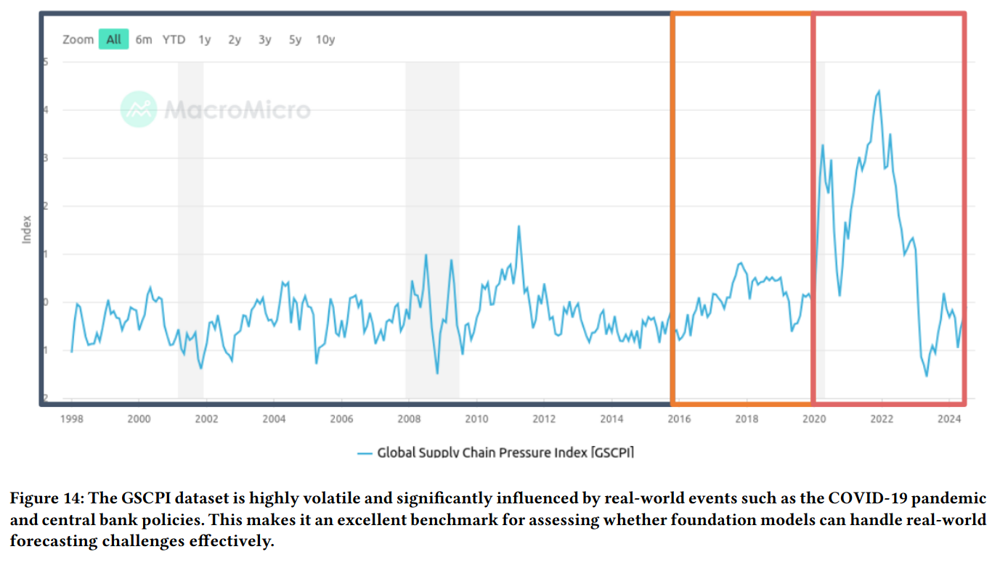
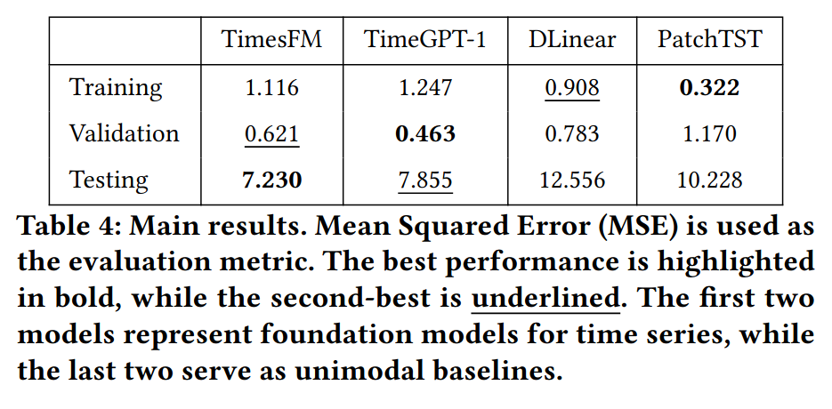

# Are Foundation Models Effective for Time Series Forecasting?   
**(Project ADSL-113-2)**  

## Introduction  

**In our perspective, somewhat.**  

With the advancement of foundation models like GPT-3 in NLP and ViTs in computer vision, researchers have started exploring their application in time series forecasting. In this project, we evaluate the effectiveness of current foundation models in this domain. Specifically, we test two open-source foundation models—**TimesFM** and **TimeGPT-1**—on the **GSCPI** dataset, a real-world dataset focused on the global supply chain. This dataset is critical for manufacturing and semiconductor supply chains and exhibits highly volatile patterns.  

Additionally, we compare these models with unimodal baselines, highlighting their strengths and limitations in time series forecasting.  

<p align="center">
  
</p>


## File Structure
```
GSCPI/
    data/
    data_provider/
    model/
        tfm_model.py
        timegpt1_model.py
    pic/
        TimeGPT1/
        TimesFM/
    FM.py
    TimeGPT1_GSCPI.sh
    TimesFM_GSCPI.sh

```
- `model/`: code for different foundation models
- `pic/`: save output figures for different models
- `FM.py`: main.py for data loading, model loading, and inferencing.
- `scripts/ & .sh files`: running scripts.

---

## Requirements

There are two ways to install required packages

1.Create a conda environment with specific python version, and activate it:
    
    ```
    conda create -n TFM python=3.10
    conda activate TFM
    ```

    Install necessary packages specified in requirement.txt:
    ```
    pip install -r requirement.txt
    ```

2. Refer to each foundation model's requirements

    - For TimesFM (ICML, 2024), install the neccessary packages from https://github.com/google-research/timesfm

    - For TimeGPT-1 (arXiv preprint, 2024), install the neccessary package from https://docs.nixtla.io/docs/getting-started-timegpt_quickstart


## Run

For running this code, please follow the instructions below

Change working directory to GSCPI:
```
cd GSCPI
```

Execute the inference file:
```
./{model_name}.sh
```
"Baseline scripts can be found in the scripts folder."

---

## Results

We use the **GSCPI index** as input, consisting of a total of  319 instances. The lookback window is set to 32, and the prediction length is  6.

<p align="center">
  
</p>

## Discussion
As shown in the main results, the foundation models generally perform well on the test datasets. This outcome can be attributed to the nature of the dataset: limited instances (a total of 319), high volatility, and significant conceptual drift.

However, the foundation models do not outperform the unimodal baselines on the training data, which is somewhat expected. This behavior can be explained by the fact that the  baselines are more effective when there is a larger number of instances available for learning patterns. This also aligns with the concerns raised in previous research regarding the effectiveness of foundation models for time series tasks. Specifically, when sufficient and highly patterned training data is available, training a local forecasting model may be a more efficient approach.

In our perspective, at least for now, foundation models show promise for forecasting tasks, but their success is heavily dependent on the nature of the dataset. There is still considerable room for improvement before foundation models can achieve the same level of success in time series forecasting as they have in domains like NLP and computer vision.

#### Below we also list out the pros and cons of time series foundation models in the time series domain:

#### Pros
- Effective for limited data
- Convenient for generalization across datasets**
- Scalable for large, complex time series problems

#### Cons
- Costly in terms of computation
- Less effective for large, structured datasets
- Require careful tuning for optimal performance

---

## Acknowledgements  

Special thanks to the following useful GitHub repositories:  

- [Nixtla](https://github.com/Nixtla/nixtla)  
- [TimesFM](https://github.com/google-research/timesfm)  
- [PatchTST](https://github.com/yuqinie98/PatchTST)  
- [DLinear](https://github.com/vivva/DLinear)  

